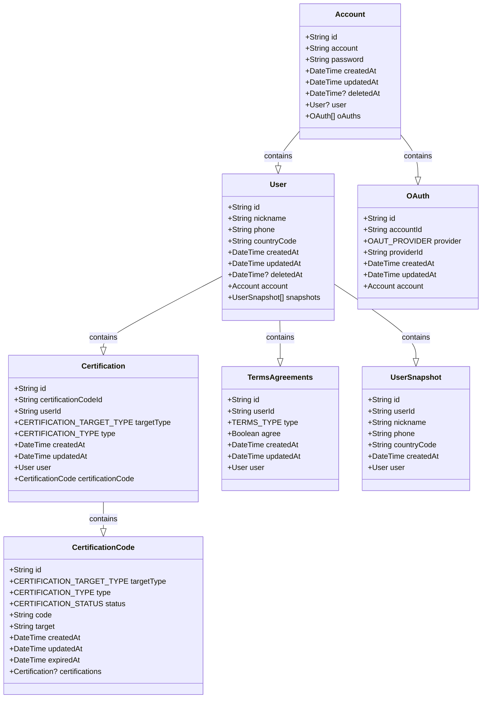

```mermaid
classDiagram

class User {
  +String id
  +String nickname
  +String phone
  +String countryCode
  +DateTime createdAt
  +DateTime updatedAt
  +DateTime? deletedAt
  +Account account
  +UserSnapshot[] snapshots
}

class Account {
  +String id
  +String account
  +String password
  +DateTime createdAt
  +DateTime updatedAt
  +DateTime? deletedAt
  +User? user
  +OAuth[] oAuths
}

class OAuth {
  +String id
  +String accountId
  +OAUT_PROVIDER provider
  +String providerId
  +DateTime createdAt
  +DateTime updatedAt
  +Account account
}

class Certification {
  +String id
  +String certificationCodeId
  +String userId
  +CERTIFICATION_TARGET_TYPE targetType
  +CERTIFICATION_TYPE type
  +DateTime createdAt
  +DateTime updatedAt
  +User user
  +CertificationCode certificationCode
}

class CertificationCode {
  +String id
  +CERTIFICATION_TARGET_TYPE targetType
  +CERTIFICATION_TYPE type
  +CERTIFICATION_STATUS status
  +String code
  +String target
  +DateTime createdAt
  +DateTime updatedAt
  +DateTime expiredAt
  +Certification? certifications
}

class TermsAgreements {
  +String id
  +String userId
  +TERMS_TYPE type
  +Boolean agree
  +DateTime createdAt
  +DateTime updatedAt
  +User user
}

class UserSnapshot {
  +String id
  +String userId
  +String nickname
  +String phone
  +String countryCode
  +DateTime createdAt
  +User user
}

%% Domains
%% Auth Domain
Account --|> User : contains
Account --|> OAuth : contains

%% User Domain
User --|> UserSnapshot : contains

%% Certification Domain
User --|> Certification : contains
Certification --|> CertificationCode : contains

%% TermsAgreements Domain
User --|> TermsAgreements : contains

```
