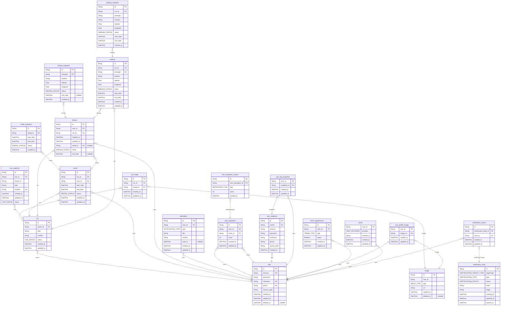

# uncar

> Generated by [`prisma-markdown`](https://github.com/samchon/prisma-markdown)

- [default](#default)

## default

### `car`

**Properties**

- `id`:
- `owner_id`:
- `type`:
- `number`:
- `status`:
- `created_at`:
- `updated_at`:

### `car_image`

**Properties**

- `id`:
- `car_id`:
- `image_id`:
- `created_at`:
- `updated_at`:

### `car_snapshot`

**Properties**

- `id`:
- `car_id`:
- `owner_id`:
- `type`:
- `number`:
- `created_at`:
- `updated_at`:
- `status`:

### `rental`

**Properties**

- `id`:
- `car_id`:
- `user_id`:
- `start_date`:
- `end_date`:
- `status`:
- `created_at`:
- `updated_at`:

### `rental_snapshot`

**Properties**

- `id`:
- `rental_id`:
- `start_date`:
- `end_date`:
- `status`:
- `created_at`:

### `driving`

**Properties**

- `id`:
- `user_id`:
- `car_id`:
- `created_at`:
- `updated_at`:
- `rental_id`:
- `status`:
- `end_date`:

### `driving_snapshot`

**Properties**

- `id`:
- `drivingId`:
- `location`:
- `latitude`:
- `longitude`:
- `status`:
- `end_date`:
- `created_at`:

### `parking`

**Properties**

- `id`:
- `car_id`:
- `drivingId`:
- `location`: 주차 위치 (주소)
- `latitude`:
- `longitude`:
- `status`:
- `start_date`:
- `end_date`:
- `created_at`:
- `updated_at`:

### `parking_snapshot`

**Properties**

- `id`:
- `car_id`:
- `drivingId`:
- `location`:
- `latitude`:
- `longitude`:
- `status`:
- `start_date`:
- `end_date`:
- `created_at`:

### `notification`

**Properties**

- `id`:
- `user_id`:
- `type`:
- `title`:
- `content`:
- `read_at`:
- `created_at`:
- `updated_at`:

### `user_reputation`

**Properties**

- `id`:
- `user_id`:
- `writer_id`:
- `score`:
- `created_at`:
- `updated_at`:

### `user_reputation_reason`

**Properties**

- `id`:
- `user_reputation_id`:
- `type`:
- `score`:
- `created_at`:

### `image`

**Properties**

- `id`:
- `user_id`:
- `type`:
- `url`:
- `created_at`:
- `deleted_at`:

### `user`

**Properties**

- `id`:
- `account`:
- `password`:
- `nickname`:
- `phone`:
- `country_code`:
- `created_at`:
- `updated_at`:
- `deleted_at`:

### `user_snapshot`

**Properties**

- `id`:
- `userId`:
- `account`:
- `password`:
- `nickname`:
- `phone`:
- `contry_code`:
- `created_at`:

### `user_last_snapshot`

**Properties**

- `user_id`: 사용자 ID
- `snapshot_id`: 스냅샷 ID
- `created_at`:
- `updated_at`:

### `user_profile_image`

**Properties**

- `user_id`: 사용자 ID
- `image_id`: 이미지 ID
- `created_at`:
- `updated_at`:

### `terms_agreements`

**Properties**

- `id`: 약관동의 ID
- `user_id`: 사용자 ID
- `type`:
- `agree`:
- `created_at`:
- `updated_at`:

### `oauth`

**Properties**

- `user_id`:
- `provider`:
- `provider_id`:
- `created_at`:
- `updated_at`:

### `certification_record`

**Properties**

- `id`:
- `certification_code_id`:
- `user_id`:
- `created_at`:
- `updated_at`:

### `certification_code`

**Properties**

- `id`:
- `targetType`:
- `type`:
- `status`:
- `code`:
- `target`:
- `created_at`:
- `updated_at`:
- `expires_at`:
