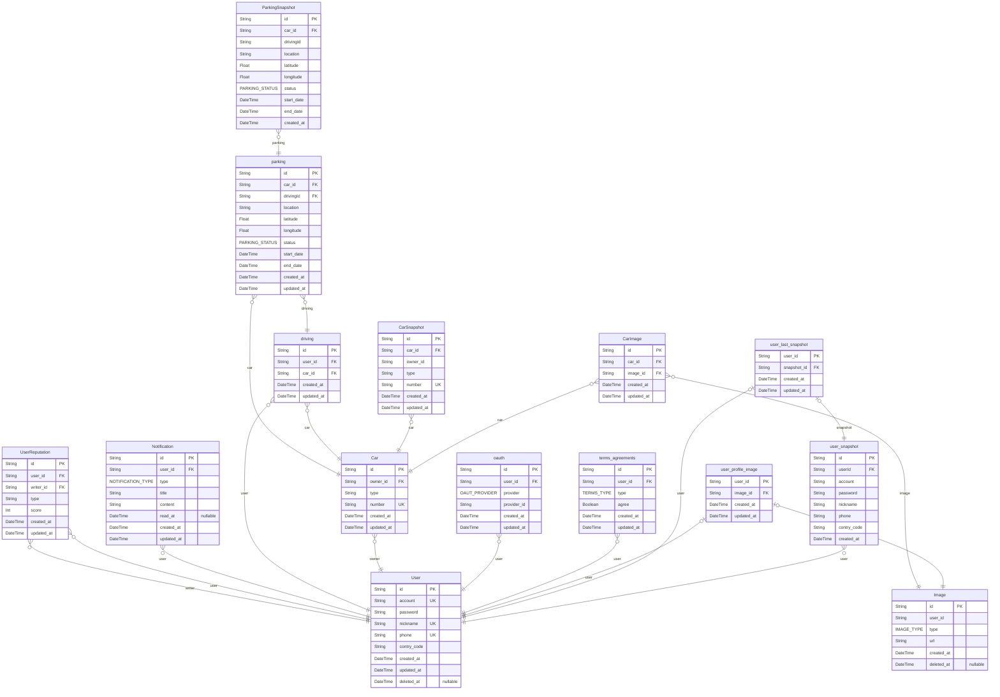

# uncar
> Generated by [`prisma-markdown`](https://github.com/samchon/prisma-markdown)

- [default](#default)

## default

### `User`

**Properties**
  - `id`: 
  - `account`: 
  - `password`: 
  - `nickname`: 
  - `phone`: 
  - `contry_code`: 
  - `created_at`: 
  - `updated_at`: 
  - `deleted_at`: 

### `user_snapshot`

**Properties**
  - `id`: 
  - `userId`: 
  - `account`: 
  - `password`: 
  - `nickname`: 
  - `phone`: 
  - `contry_code`: 
  - `created_at`: 

### `user_last_snapshot`

**Properties**
  - `user_id`: 사용자 ID
  - `snapshot_id`: 스냅샷 ID
  - `created_at`: 
  - `updated_at`: 

### `user_profile_image`

**Properties**
  - `user_id`: 사용자 ID
  - `image_id`: 이미지 ID
  - `created_at`: 
  - `updated_at`: 

### `terms_agreements`

**Properties**
  - `id`: 약관동의 ID
  - `user_id`: 사용자 ID
  - `type`: 
  - `agree`: 
  - `created_at`: 
  - `updated_at`: 

### `oauth`

**Properties**
  - `id`: 
  - `user_id`: 
  - `provider`: 
  - `provider_id`: 
  - `created_at`: 
  - `updated_at`: 

### `Car`

**Properties**
  - `id`: 
  - `owner_id`: 
  - `type`: 
  - `number`: 
  - `created_at`: 
  - `updated_at`: 

### `CarImage`

**Properties**
  - `id`: 
  - `car_id`: 
  - `image_id`: 
  - `created_at`: 
  - `updated_at`: 

### `CarSnapshot`

**Properties**
  - `id`: 
  - `car_id`: 
  - `owner_id`: 
  - `type`: 
  - `number`: 
  - `created_at`: 
  - `updated_at`: 

### `driving`

**Properties**
  - `id`: 
  - `user_id`: 
  - `car_id`: 
  - `created_at`: 
  - `updated_at`: 

### `parking`

**Properties**
  - `id`: 
  - `car_id`: 
  - `drivingId`: 
  - `location`: 주차 위치 (주소)
  - `latitude`: 
  - `longitude`: 
  - `status`: 
  - `start_date`: 
  - `end_date`: 
  - `created_at`: 
  - `updated_at`: 

### `ParkingSnapshot`

**Properties**
  - `id`: 
  - `car_id`: 
  - `drivingId`: 
  - `location`: 
  - `latitude`: 
  - `longitude`: 
  - `status`: 
  - `start_date`: 
  - `end_date`: 
  - `created_at`: 

### `Notification`

**Properties**
  - `id`: 
  - `user_id`: 
  - `type`: 
  - `title`: 
  - `content`: 
  - `read_at`: 
  - `created_at`: 
  - `updated_at`: 

### `UserReputation`

**Properties**
  - `id`: 
  - `user_id`: 
  - `writer_id`: 
  - `type`: 
  - `score`: 
  - `created_at`: 
  - `updated_at`: 

### `Image`

**Properties**
  - `id`: 
  - `user_id`: 
  - `type`: 
  - `url`: 
  - `created_at`: 
  - `deleted_at`: 